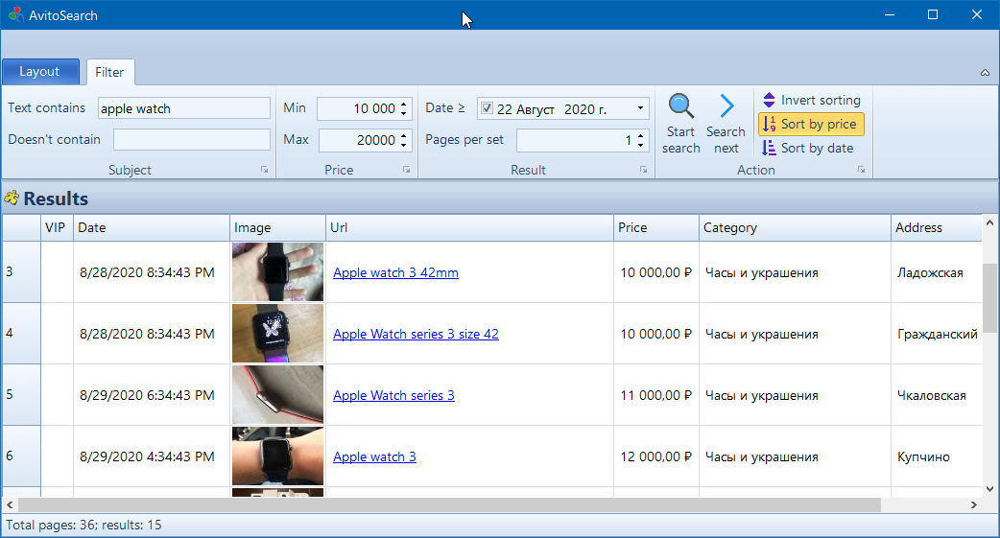

Avito Search
=======================

This repository stores the code demonstrating a website parsing capabilities via such libraries as HtmlAgilityPack.

What's inside?
-----------------------

First of all it's **Avito.Search** library which allows you to get search results as easy as possible.<br/>
Also you can use **Avito.UI.WinForms.Window** application which demonstrates the functionality visually.

How does it work?
-----------------------

It's based on the public query syntax https://www.avito.ru/?bt=1&p=1&q=apple<br/>
A simple **WebRequest** is used to get the html content.
```
WebRequest request = WebRequest.Create(url);
HttpWebResponse response;
try
{
    response = (HttpWebResponse)request.GetResponse();
}
catch (WebException)
...
```
Then it's being parsed via [HtmlAgilityPack](https://github.com/zzzprojects/html-agility-pack) library.
```
HtmlDocument doc = new HtmlDocument();
doc.OptionFixNestedTags = true;
doc.LoadHtml(content);
```
For example, a link to the latest page can be found with the following code
```
doc.DocumentNode.SelectNodes("//a[@class='pagination-page']")?.LastOrDefault()
```

How to use **Avito.Search** library?
-----------------------

Once the library is referenced you can use it like in the example below
```
AvitoSettings settings = new AvitoSettings();
AvitoPageRequest request = new AvitoPageRequest(settings, "apple watch", searchInTitlesOnly: true);
AvitoPage page = new AvitoPage(settings, request);
Filter filter = new Filter
{
    TitleContains = new[] { "apple", "watch" },
    TitleDoesNotContain = new[] { "46m" },
    DatesAfter = DateTime.Now.AddDays(-5),
    MaxPrice = 20000,
    MinPrice = 10000
};
List<WebSearchResult> results = page.GetResults(filter);
```
So, it can be easily integrated into any kind of applications like
* Desktop UI (WinForms, WPF)
* Web application (ASP.NET)
* Server-side application
* Bot (Telegram, etc.)

How does **Avito.UI.WinForms.Window** application look like?



References
-----------------------

* Icons for the demo application were downloaded from https://www.freeicons.io/<br/>
    * [Raj Dev](https://www.freeicons.io/profile/714)
        * https://www.freeicons.io/technology-icons-2/asset-refresh-load-icon-19271
    * [Muhammad Haq](https://www.freeicons.io/profile/823)
        * https://www.freeicons.io/user-interface-icons-7/sort-arrows-couple-pointing-up-and-down-icon-37286
    * [icon king](https://www.freeicons.io/profile/3)
        * https://www.freeicons.io/user-interface-and-electronics/export-file-document-doc-produce-execute-interface-e-caf-icon-862
    * [Free Preloaders](https://www.freeicons.io/profile/726)
        * https://www.freeicons.io/office-and-workstation-icons-5/next-icon-18938
* [HtmlAgilityPack](https://github.com/zzzprojects/html-agility-pack) library
    * [MIT License](https://github.com/zzzprojects/html-agility-pack/blob/master/LICENSE)
* [Krypton WinForms controls](https://github.com/ComponentFactory/Krypton)
    * [BSD-3-Clause License](https://github.com/ComponentFactory/Krypton/blob/master/LICENSE)

Disclaimer
-----------------------

* Developed for educational purposes only.
* Avito.ru website is used as an example.
    * Don't forget to check https://www.avito.ru/info/polzovatelskoe_soglashenie if you are going to use it somehow